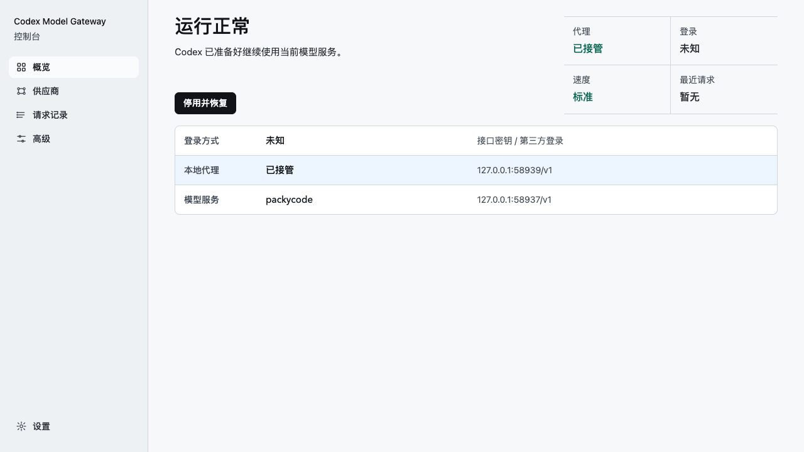

# codex-fast-proxy

[](https://github.com/gaoguobin/codex-fast-proxy/actions/workflows/ci.yml)

Codex App auth-split proxy for third-party OpenAI-compatible APIs.

Use Codex App while you sign in with ChatGPT for the full App UI, but keep model requests on your
third-party OpenAI-compatible API provider. `codex-fast-proxy` routes provider traffic through a
local proxy, applies an optional provider-auth override, preserves streaming, and keeps the App's
own Fast controls intact when they are available.

[Chinese Guide](docs/README.zh-CN.md) · [Quick Start](#quick-start) · [Common Workflows](#common-workflows) · [Diagnostics](#diagnostics) · [Safety](#safety) · [Advanced Usage](docs/advanced-usage.md) · [Sponsor](#sponsor)



## Why

Codex App features such as plugin marketplace, GitHub/Apps connectors, manual Fast controls, status
hints, and voice input are tied to signing in with ChatGPT. Users of third-party API providers still
need model requests to use the provider's endpoint and API key.

This project keeps those two concerns separate: Codex App can stay signed in with ChatGPT for UI and
connector features, while `/v1/responses` model traffic continues through your configured provider.
Fast/Priority routing is then treated as a provider capability that should be measured, not assumed.

## What It Does

- Lets Codex App stay signed in with ChatGPT while provider API requests use your third-party
  upstream.
- Routes Codex provider traffic from an automatically selected local `127.0.0.1` port to your saved
  upstream provider.
- Optionally replaces proxied provider `Authorization` with a key from a proxy-managed local auth
  file, so ChatGPT account auth is not forwarded to the third-party provider.
- Only patches `POST /v1/responses`, and only when the configured Fast policy allows it.
- Leaves `model`, `reasoning`, `tools`, `input`, request bodies, and SSE frames unchanged.
- Preserves Codex App's manual Fast controls when the App sends its own `service_tier`.
- Installs a Codex `SessionStart` hook so future Codex sessions can start a missing proxy.
- Provides read-only diagnostics with redacted status, recent traffic, and benchmark summary.

## Fast Effect

Fast/Priority is an important feature, but it is not a local guarantee. This proxy can send the
priority hint, but the real latency effect depends on the upstream OpenAI-compatible provider. Some
providers accept `service_tier="priority"` without making the measured workload faster, and some may
not echo priority metadata in the response.

Use the built-in A/B benchmark as the source of truth for your current provider and model:

```text
Run the Codex Fast proxy A/B benchmark
```

Benchmark results separate three facts: whether priority requests were accepted, whether the
measured workload got faster, and whether provider response metadata explicitly confirmed priority.
The benchmark also records whether the control split was valid, so default samples must omit
`service_tier` while priority samples send the expected value.

## Quick Start

Paste this into Codex:

```text
Fetch and follow instructions from https://raw.githubusercontent.com/gaoguobin/codex-fast-proxy/main/.codex/INSTALL.md
```

The installer starts the Chinese Control UI and prints a local URL. Open that Control UI URL in your
external browser and click `启用`. After the UI says setup is ready, restart Codex App or open a new
Codex CLI process so Codex reloads its provider config. Future sessions use the installed startup
hook.

Install is intentionally file-only: it clones the repo, installs the Python package, and links the
skill. It does not switch your provider, start the proxy, or install hooks until you explicitly
enable it.

## Common Workflows

Most users should operate this through natural language in Codex:

| Goal | Say this to Codex |
| --- | --- |
| Install from GitHub | `Fetch and follow instructions from https://raw.githubusercontent.com/gaoguobin/codex-fast-proxy/main/.codex/INSTALL.md` |
| Enable | Open the Control UI and click `启用` |
| Open Control UI | `Open Codex Fast proxy Control UI` |
| Check status | `Show Codex Fast proxy status` |
| Open diagnostics | Use the Control UI diagnostics section |
| Prepare ChatGPT login | `Prepare Codex Fast proxy for ChatGPT account login` |
| Run A/B benchmark | `Run the Codex Fast proxy A/B benchmark` |
| Change upstream URL | `Set Codex Fast proxy upstream to https://api.example.com/v1` |
| Check for updates | `Check Codex Fast proxy updates` |
| Update | `Fetch and follow instructions from https://raw.githubusercontent.com/gaoguobin/codex-fast-proxy/main/.codex/UPDATE.md` |
| Uninstall | `Fetch and follow instructions from https://raw.githubusercontent.com/gaoguobin/codex-fast-proxy/main/.codex/UNINSTALL.md` |

Advanced command-line usage lives in [docs/advanced-usage.md](docs/advanced-usage.md).

## After Enable

A healthy setup should show `运行正常` in the Control UI. Diagnostics should report:

- `healthy=true`
- `config_matches=true`
- `startup_hook=true`
- `runtime_matches=true`
- `needs_restart=false`

The local proxy URL is an internal detail. Ordinary users should use only the Control UI URL and the
model service URL shown in the Control UI.

In API-key mode, the default `auto` policy can inject global priority when Codex omits
`service_tier`. In ChatGPT-login or unclear states, the default behavior is conservative and
preserves Codex's own Fast choice.

## Sign In With ChatGPT

Signing in with ChatGPT is optional. Use it only if you want the full Codex App UI, such as plugin
marketplace, GitHub/Apps/connectors, manual Fast controls, status hints, or voice input. The proxy's
auth split keeps model requests on your third-party provider after that sign-in.

Before switching Codex App to ChatGPT login, ask Codex to prepare provider auth:

```text
Prepare Codex Fast proxy for ChatGPT account login
```

The manager will copy the current working third-party provider key into
`~/.codex/codex-fast-proxy-state/provider-auth.json` without printing the key. If it reports
`needs_restart=true`, do not log in yet. First restart Codex App or let Codex run:

```powershell
python -m codex_fast_proxy start
```

If ChatGPT login on Windows fails with `OSError: [WinError 10013] ... socket ...`, retry after
running these commands in an Administrator PowerShell:

```powershell
net stop winnat
netsh interface ipv4 show excludedportrange protocol=tcp
net start winnat
netsh interface ipv4 show excludedportrange protocol=tcp
```

## Diagnostics

Open the Control UI and expand `诊断`. This is the normal diagnostics path for users.

The old proxy-hosted dashboard remains an advanced read-only fallback. It shows local proxy status,
upstream URL, Fast policy, auth mode, recent `/v1/responses` traffic, metadata checks, and the
latest benchmark summary if one exists.
It does not show prompts, request bodies, response content, API keys, cookies, or headers.

## Safety

- The proxy handles provider API requests only; it does not intercept ChatGPT plugin marketplace,
  GitHub, Apps, connectors, or ChatGPT cookies.
- Service-tier changes are limited to `POST /v1/responses`.
- SSE streaming responses are passed through unchanged.
- Logs are redacted and contain only operational metadata such as path, status, latency, stream flag,
  and whether `service_tier` was injected.
- Uninstall is two-phase when needed: restore config first, keep the proxy alive for the current
  session, then clean up after Codex restarts.
- If ChatGPT login is active and uninstall would restore direct upstream, uninstall stops before
  changing config and asks for explicit confirmation. Keep the proxy enabled, switch back to
  API-key/third-party auth before uninstalling, or explicitly accept that direct third-party
  providers may reject ChatGPT auth with 401.

## Agent Skill And Discovery

This repository includes an Agent Skill for Codex:

- Skill name: `codex-fast-proxy`
- Skill path: `skills/codex-fast-proxy/SKILL.md`
- Primary use case: install, enable, verify, benchmark, update, change upstream, prepare ChatGPT
  login compatibility, and uninstall this proxy.

Tools that index public GitHub repositories for Agent Skills can discover the skill at the path
above. This project does not claim to be listed on SkillsMP or any other marketplace, and it is not
an official OpenAI plugin or official marketplace project.

## Plugin Readiness

The repository includes `.codex-plugin/plugin.json` metadata pointing to `./skills/` for future
Codex plugin distribution workflows. The supported installation path today is still the
Codex-managed install prompt above. Plugin metadata does not install hooks, change provider config,
start the proxy, or imply official marketplace listing.

## Sponsor

If `codex-fast-proxy` saves you time, consider [sponsoring the author](https://gaoguobin.github.io/sponsor)
or supporting the project from the GitHub Sponsors button.

## License

MIT
