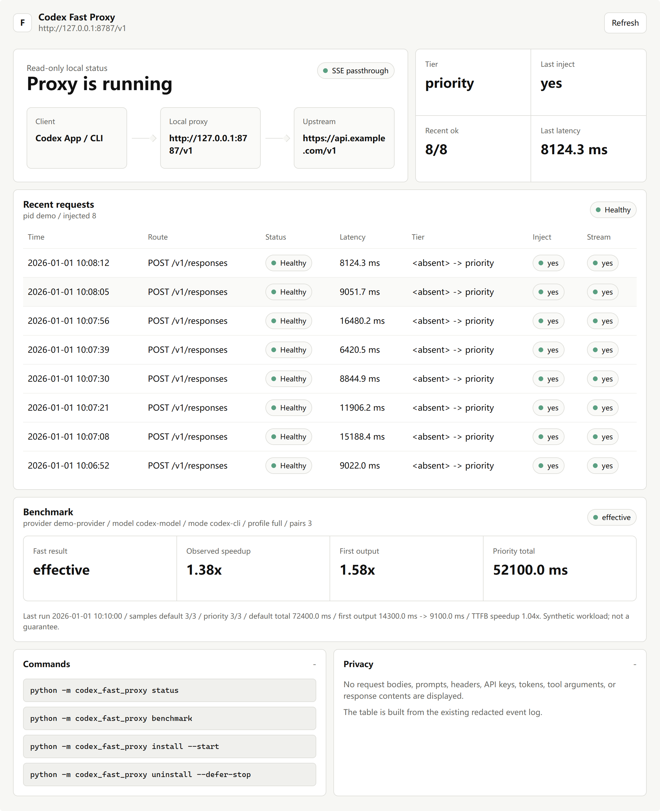

# codex-fast-proxy

[](https://github.com/gaoguobin/codex-fast-proxy/actions/workflows/ci.yml)

Codex App Fast/Priority proxy for third-party OpenAI-compatible APIs.

This project is for Codex App users who already use a third-party API provider or relay service.
It lets Codex App route model requests through a local proxy, keep streaming intact, preserve the
App's own Fast control when available, and optionally inject `service_tier="priority"` when Codex
does not send a tier.

[Chinese Guide](docs/README.zh-CN.md) · [Quick Start](#quick-start) · [Common Workflows](#common-workflows) · [Dashboard](#dashboard) · [Safety](#safety) · [Advanced Usage](docs/advanced-usage.md) · [Sponsor](#sponsor)



## Why

Codex CLI can already use Fast mode. The main use case here is Codex App + third-party API
providers, where users may still want the richer App experience: plugin marketplace, GitHub/Apps
connectors, manual Fast controls, status hints, voice input, and a local dashboard.

## What It Does

- Routes Codex provider traffic from `http://127.0.0.1:8787/v1` to your saved upstream provider.
- Only patches `POST /v1/responses`, and only when the configured Fast policy allows it.
- Leaves `model`, `reasoning`, `tools`, `input`, request bodies, and SSE frames unchanged.
- Supports an optional auth split for ChatGPT-login users: provider API requests can use a separate
  environment variable while ChatGPT plugin/GitHub/App connector traffic remains untouched.
- Installs a Codex `SessionStart` hook so future Codex sessions can start a missing proxy.
- Provides a read-only local dashboard with redacted status, recent traffic, and benchmark summary.

## Quick Start

Paste this into Codex:

```text
Fetch and follow instructions from https://raw.githubusercontent.com/gaoguobin/codex-fast-proxy/main/.codex/INSTALL.md
```

Then restart Codex App, return to the same conversation, and say:

```text
Enable Codex Fast proxy
```

After enable, restart Codex App again or open a new Codex CLI process so Codex reloads its provider
config. Future sessions use the installed startup hook.

Install is intentionally file-only: it clones the repo, installs the Python package, and links the
skill. It does not switch your provider, start the proxy, or install hooks until you explicitly
enable it.

## Common Workflows

Most users should operate this through natural language in Codex:

| Goal | Say this to Codex |
| --- | --- |
| Install from GitHub | `Fetch and follow instructions from https://raw.githubusercontent.com/gaoguobin/codex-fast-proxy/main/.codex/INSTALL.md` |
| Enable proxy | `Enable Codex Fast proxy` |
| Check status | `Show Codex Fast proxy status` |
| Open dashboard | Open `http://127.0.0.1:8787/v1` |
| Prepare ChatGPT login | `Prepare Codex Fast proxy for ChatGPT account login` |
| Run A/B benchmark | `Run the Codex Fast proxy A/B benchmark` |
| Change upstream URL | `Set Codex Fast proxy upstream to https://api.example.com/v1` |
| Check for updates | `Check Codex Fast proxy updates` |
| Update | `Fetch and follow instructions from https://raw.githubusercontent.com/gaoguobin/codex-fast-proxy/main/.codex/UPDATE.md` |
| Uninstall | `Fetch and follow instructions from https://raw.githubusercontent.com/gaoguobin/codex-fast-proxy/main/.codex/UNINSTALL.md` |

Advanced command-line usage lives in [docs/advanced-usage.md](docs/advanced-usage.md).

## After Enable

A healthy enabled setup should report:

- `healthy=true`
- `config_matches=true`
- `startup_hook=true`
- `runtime_matches=true`
- `needs_restart=false`
- `base_url=http://127.0.0.1:8787/v1`

In API-key mode, the default `auto` policy can inject global priority when Codex omits
`service_tier`. In ChatGPT-login or unclear states, the default behavior is conservative and
preserves Codex's own Fast choice.

## ChatGPT Login

ChatGPT login is optional. Use it only if you want the full Codex App UI, such as plugin
marketplace, GitHub/Apps/connectors, manual Fast controls, status hints, or voice input.

Before switching Codex App to ChatGPT login, ask Codex to prepare provider auth:

```text
Prepare Codex Fast proxy for ChatGPT account login
```

The manager will migrate or record the third-party provider key as an environment variable without
printing the key. If it reports `needs_restart=true`, do not log in yet. First restart Codex App or
let Codex run:

```powershell
python -m codex_fast_proxy start
```

If ChatGPT login on Windows fails with `OSError: [WinError 10013] ... socket ...`, retry after
running these commands in an Administrator PowerShell:

```powershell
net stop winnat
netsh interface ipv4 show excludedportrange protocol=tcp
net start winnat
netsh interface ipv4 show excludedportrange protocol=tcp
```

## Dashboard

Open:

```text
http://127.0.0.1:8787/v1
```

The dashboard is read-only. It shows local proxy status, upstream URL, Fast policy, auth mode,
recent `/v1/responses` traffic, metadata checks, and the latest benchmark summary if one exists.
It does not show prompts, request bodies, response content, API keys, cookies, or headers.

## Safety

- The proxy handles provider API requests only; it does not intercept ChatGPT plugin marketplace,
  GitHub, Apps, connectors, or ChatGPT cookies.
- Service-tier changes are limited to `POST /v1/responses`.
- SSE streaming responses are passed through unchanged.
- Logs are redacted and contain only operational metadata such as path, status, latency, stream flag,
  and whether `service_tier` was injected.
- Uninstall is two-phase when needed: restore config first, keep the proxy alive for the current
  session, then clean up after Codex restarts.
- If ChatGPT login is active and uninstall would restore direct upstream, uninstall stops before
  changing config and asks for explicit confirmation. Keep the proxy enabled, switch back to
  API-key/third-party auth before uninstalling, or explicitly accept that direct third-party
  providers may reject ChatGPT auth with 401.

## Agent Skill And Discovery

This repository includes an Agent Skill for Codex:

- Skill name: `codex-fast-proxy`
- Skill path: `skills/codex-fast-proxy/SKILL.md`
- Primary use case: install, enable, verify, benchmark, update, change upstream, prepare ChatGPT
  login compatibility, and uninstall this proxy.

Tools that index public GitHub repositories for Agent Skills can discover the skill at the path
above. This project does not claim to be listed on SkillsMP or any other marketplace, and it is not
an official OpenAI plugin or official marketplace project.

## Plugin Readiness

The repository includes `.codex-plugin/plugin.json` metadata pointing to `./skills/` for future
Codex plugin distribution workflows. The supported installation path today is still the
Codex-managed install prompt above. Plugin metadata does not install hooks, change provider config,
start the proxy, or imply official marketplace listing.

## Sponsor

If `codex-fast-proxy` saves you time, consider [sponsoring the author](https://gaoguobin.github.io/sponsor)
or supporting the project from the GitHub Sponsors button.

## License

MIT
